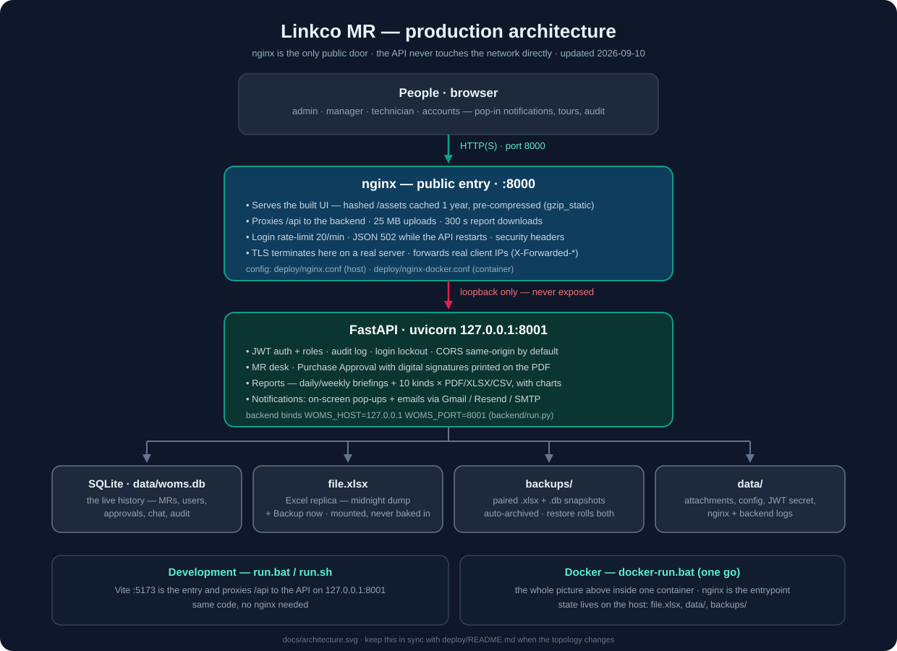

# Work Order Management System (WOMS)

A production-ready operations dashboard for **Linkco’s Material Request (MR) log**.

**SQLite (`data/woms.db`) is the only live work-order history.** `file.xlsx` is a midnight replica of all records (plus Backup now).

The application:

1. Serves material requests from the database
2. Displays KPIs, analytics and a searchable table counted from live records
3. Lets authorized users edit records (database first)
4. At midnight (and Backup now) dumps every database row into the **same Excel workbook** and snapshots SQLite
5. Seeds the database from Excel on first boot (empty DB), or when an admin chooses Seed / Upload-then-seed
6. Calculates statistics dynamically — no fake or stored KPI tables



Production topology: **nginx is the only public door** — it serves the built UI and proxies `/api` to the FastAPI backend on `127.0.0.1:8001` (loopback, never exposed). In development the Vite dev server plays that entry role; in Docker the whole picture lives in one container (`docker-run.bat` / `docker-run.sh`). Details: [`deploy/README.md`](deploy/README.md).

**AI / contributors:** read and update [`SKILLS.md`](SKILLS.md) whenever behavior changes. Also [`AGENTS.md`](AGENTS.md) and [`docs/EXCEL_ANALYSIS.md`](docs/EXCEL_ANALYSIS.md).

**Data loss / Docker down:** [`docs/RECOVERY.md`](docs/RECOVERY.md) — find the database, restore snapshots, reset admin. Quick check: `./scripts/recover.sh`.

**Train operators:** open [`docs/training/index.html`](docs/training/index.html) (arrows / space to present) — includes a "What's new" section on the approvals desk tabs, pop-up notifications, digital signing, and email. Go-live list: [`docs/PRODUCTION.md`](docs/PRODUCTION.md). System picture: [`docs/architecture.svg`](docs/architecture.svg).

## Quick start

### First run: the setup wizard (recommended)

```bash
./setup.sh        # Linux / macOS
setup.bat         # Windows (double-click works too)
```

(Both create `backend/.venv` + install requirements on first run, then run
`python3 backend/launch.py`.)

If no `.env` exists, a web form opens on **port 8081**: it asks for the SMB
backup account, the separate Files-share account, where files and backups
are created, and every other option; validates credentials/folders/mounts,
creates missing folders, writes `.env`, then starts the main server.
Re-open it any time with `python3 backend/launch.py --setup`.
See `docs/setup-wizard.md`.

### One command

**Docker (recommended)** — installs Docker if missing, builds one image that runs the production topology (nginx on port 8000 serving the UI + proxying `/api` to the API on loopback), and opens everything at http://127.0.0.1:8000:

```bash
chmod +x docker-run.sh run.sh
./docker-run.sh
```

Windows: double-click `docker-run.bat`.

**Linux / macOS without forcing Docker**

```bash
chmod +x run.sh
./run.sh
```

`./run.sh` uses Docker when it can; `./run.sh --local` installs Python/Node on the host instead.

**Windows (host Python + Node)**

Double-click `run.bat`, or from Command Prompt:

```bat
run.bat
```

Local mode installs Python packages into `.venv`, runs `npm install` if needed, then starts:

- UI — http://127.0.0.1:5173  ← open this one; it proxies `/api` to the API
- API — http://127.0.0.1:8001  (loopback only; in Docker, nginx serves both at http://127.0.0.1:8000)

Keep `file.xlsx` in the project root (replica of the live log; the database is the working history).

### Requirements

- Python 3.11+ (3.11–3.13 recommended; 3.14 is supported via current Pydantic wheels)
- Node.js 18+

### Manual install

### 1. Install backend

```bash
cd backend
python3 -m venv .venv
source .venv/bin/activate   # Windows: .venv\Scripts\activate
pip install -r requirements.txt
```

### 2. Generate / use the Excel workbook

The live workbook is **`file.xlsx`** at the repo root (Linkco MR logs for Shield 5 / Shield 1 and Falcon 5).

Column mapping is in Settings / `data/app_config.json`. Excel headers are not renamed. Formula columns (SN, due date, hyperlinks) and the report sheets are never overwritten.

See `docs/EXCEL_ANALYSIS.md` for the inspected structure.

### 3. Install frontend

```bash
cd frontend
npm install
```

### 4. Run

Terminal A — API (loopback `127.0.0.1:8001` — the dev UI proxies `/api` to it):

```bash
cd backend
source .venv/bin/activate
python run.py          # honors WOMS_HOST / WOMS_PORT, defaults 127.0.0.1:8001
```

Terminal B — UI (binds `0.0.0.0:5173`, proxies `/api` to the backend):

```bash
cd frontend
npm run dev
```

Open the UI, then sign in:

| Username | Password   | Role    |
| -------- | ---------- | ------- |
| admin    | admin123   | Admin   |
| manager  | manager123 | Manager |
| user     | user123    | User    |

## What the dashboard does

- **KPIs** — total, open, closed, pending, overdue, in progress, completion rate, average closing time, aging
- **Time windows** — today, yesterday, this/last week, this/last month, quarter, year, custom range
- **Weekly / monthly / yearly** analysis with year-over-year comparison
- **Status distribution** from live record values (not hard-coded)
- **Why are work orders still open?** — grouped by Delay Reason / Issue, click to drill down
- **Aging buckets** — 0–1, 2–3, 4–7, 8–14, 15–30, 31–60, 60+ days
- **Overdue** list sorted by days overdue and priority
- **Department, technician, priority** performance tables
- **Work order table** — search, sort, filter, pagination, column visibility, CSV export, inline drill-down
- **Edit** — Save writes SQLite only. Close order sets CLOSED (remark required). Excel is updated at midnight.
- **Purchase approval with digital signatures** — assign → managers sign (or return with changes) → signed slip back to the sender, **done** (signed = locked; pass to a colleague if needed; the extra Accounts step is off by default, admin toggle in Settings). Personal tabs: **To sign / Sent to sign / Received signed**, plus on-screen **pop-up notifications** and **Remind with your own message** (cooldown). The drawn signature prints on the PDF
- **Email notifications** — **Gmail** (App password), **Resend** or custom SMTP: verification, password resets, PO signature requests, follow-ups, assign-to pings, @mentions. No verified domain yet? Resend testing mode is handled automatically — mail lands in the account owner's inbox labelled `[TEST → recipient]` until you verify a domain at resend.com/domains
- **Audit log** — user, time, work order, field, old/new value (SQLite)
- **Backups** — midnight and Backup now dump DB → Excel then snapshot the pair under `backups/YYYY-MM-DD/`. Pairs older than 30 days move to `backups/archive/YYYY-MM/`; archives older than 6 months are deleted. Restore of a pair rolls both back; Excel-only copies do not overwrite live history
- **Conflict detection** — if Excel changed since you loaded the record, you get a warning instead of a silent overwrite
- **Reports** — every kind downloads as Excel (with an embedded chart), CSV or one-page PDF (daily/weekly briefings include a New/Closed/Overdue bar chart and the day matrix)
- **Auth** — admin / manager / user with configurable permissions
- **Dark / light** theme
- **Guided tours** — first-run app tour, plus a dedicated manager signing tour on Purchase Approval (auto-plays once, replay from Guide or "How signing works")
- **Motion** — animated sign-in screen, ink-style signature pad with a self-drawing hint, and a "Signed & locked" stamp when a manager signs (all respect reduced-motion)

## Database and Excel

| Action | Behaviour |
| ------ | --------- |
| Ordinary load / Refresh | Reads SQLite. Does not overwrite the database from Excel. |
| Hard refresh / Seed | Admin (or boot if DB empty) copies Excel rows into SQLite. |
| Save | SQLite only. Excel is not written. |
| Midnight / Backup now | Export all DB rows into `file.xlsx` (lock → temp → validate → replace), then snapshot SQLite + Excel |
| File locked | Daily saves still succeed. Excel dump records a health error and still snapshots SQLite. |
| File missing | Daily saves still succeed. HTTP 503 on Excel-only operations (seed/upload/import). |
| External Excel change during an Excel write | HTTP 409 conflict; user can reload or force overwrite |
| Backup now / autobackup | Export DB → Excel, then snapshot the pair. Archive after 30 days; prune archives after 180. |
| Restore paired snapshot | Rolls back database and Excel (pre-restore snapshot first) |
| Restore Excel-only copy | Replaces `file.xlsx` only. Does not silently seed the database. |

Formulas, report sheets, lists, formatting and Excel tables are preserved. Only mapped data cells on the log sheets are updated.

## Configuration

Administrators can change (Settings page or `data/app_config.json`):

- Excel file path and worksheet name
- Column mapping (Excel header ↔ internal field)
- Which statuses count as closed / pending / in progress
- Aging buckets
- Validation rules
- Backup directory
- Refresh interval

## Tests

```bash
cd /path/to/excel-dashboard
python3 -m pytest tests -q
```

Coverage includes reading Excel, uniqueness, KPI calculations, updating a row, rejecting duplicates, date validation, authentication and formula preservation.

## Production notes

- Change `jwt_secret` in Settings before exposing the app
- Serve `frontend` via `npm run build` and let FastAPI host `frontend/dist` (enabled automatically when the folder exists)
- Put the workbook on a filesystem both the API and Excel users can reach
- Keep `backups/` on the same volume or a snapshot target
- Live work orders live in SQLite (`wo_cache`); in-memory cache is invalidated on write. Suitable for tens of thousands of rows

## Project layout

```
backend/app/          FastAPI application
backend/app/excel/    SQLite-only CRUD, midnight Excel dump, lock, backup, mapping
frontend/src/       React dashboard
file.xlsx           Live workbook (replica)
data/woms.db        Live history (gitignored)
SKILLS.md           AI skills, requirements, architecture (living)
docs/EXCEL_ANALYSIS.md
tests/
```

## Pointing at your own workbook

1. Keep your sheet name (or set it in Settings)
2. Map your headers, for example `WO No` → `work_order_id`, `Date Opened` → `created_date`
3. Restart is not required — Save configuration and click Refresh
4. Do not remove the unique ID column; if you have none, the app can generate `WO-YYYY-NNNNNN`
